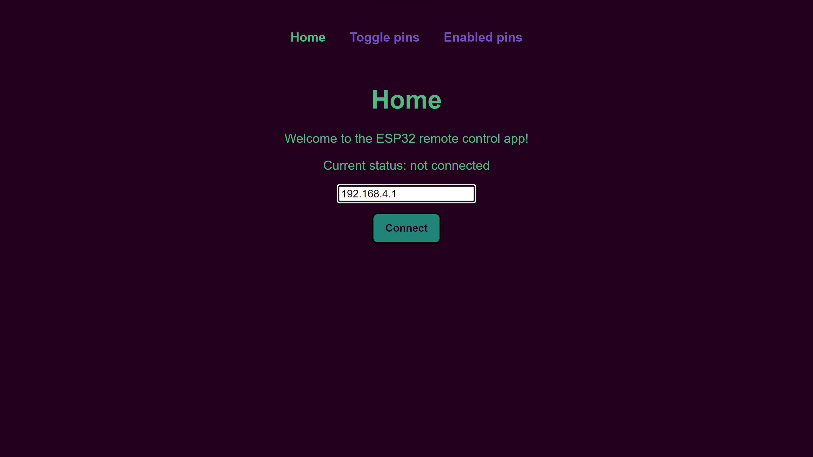
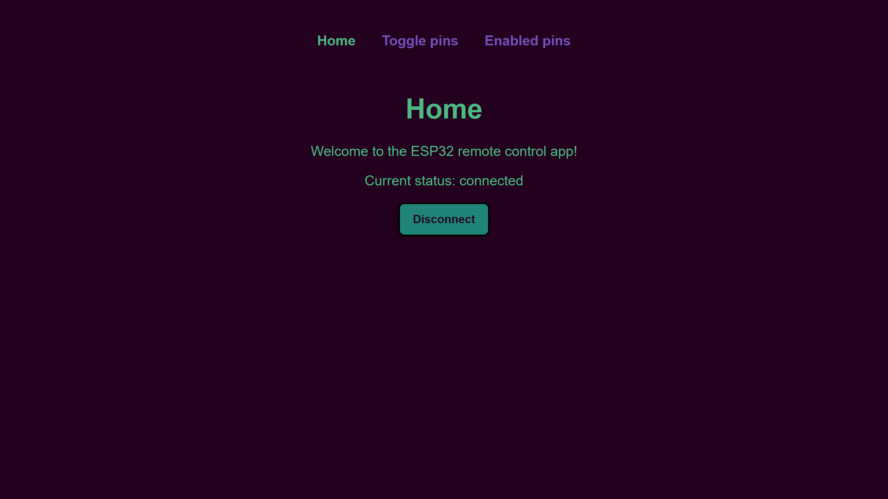
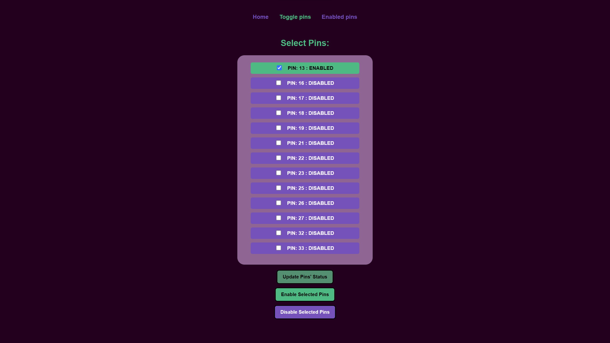
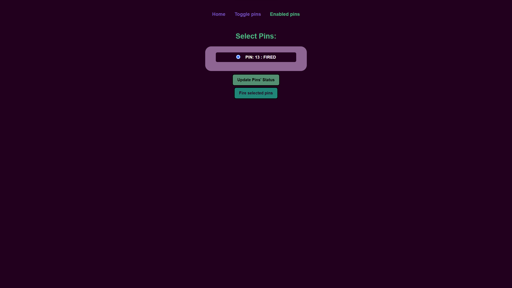
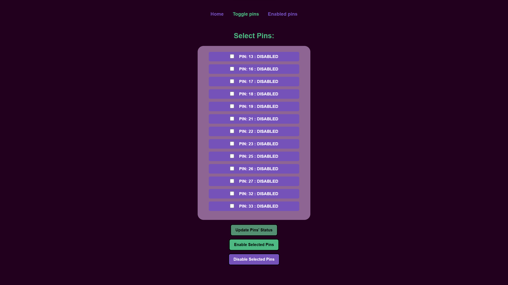

## About

The launcher uses ESP-32 microcontroller with integrated Wi-Fi.
ESP-32 acts as a server offering REST API that is used by web application to
control the relays remotely. All available ESP-32 pins can be used if needed.

## ESP-32 server 

### Connection mode

The server works either as a Soft AP or station that can connect. Launcher can
be used if a user is connected to the access point or to the common Wi-Fi AP in
the case of the station mode.

### API 

Functionality of the API is described in [API
documentation](https://documenter.getpostman.com/view/16964968/2s8YzMXkBM)

## Web application 

Frontend application is a simple Vue web app that consists of: connection view,
pin toggle, and pin "firing" view.

Connection view:

Connection view (connected):

Enabled pin view (enabled pin):

Enabled pin view (fired pin):

Toggle pin view (toggle pin):

